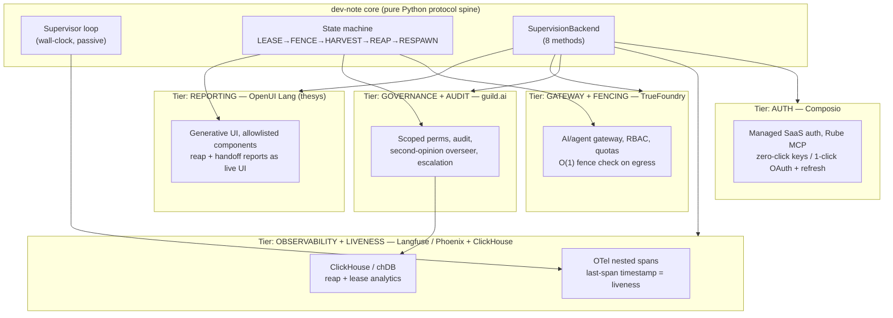
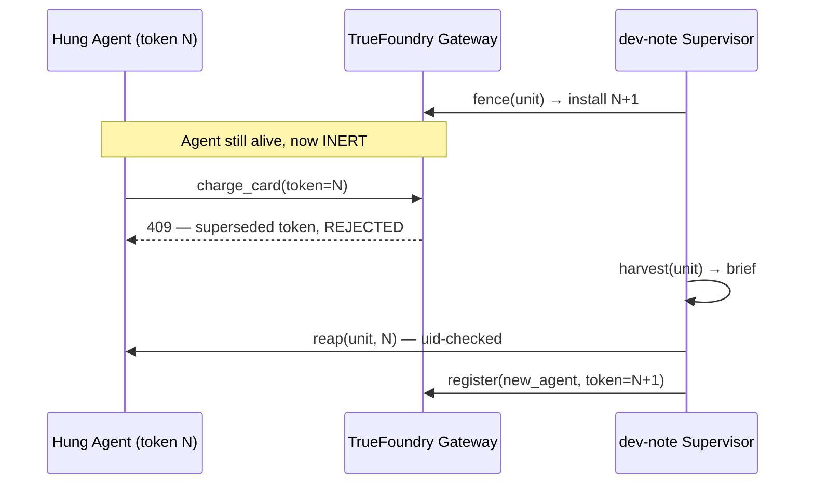

# dev-note: A Protocol Layer for Supervising Agent Fleets at Scale

**Status:** Design / RFC
**Audience:** Platform teams running 10⁴–10⁶ concurrent agents
**Thesis:** Agent supervision is a *distributed-locking* problem wearing a *process-management* costume. Solve it with leases and fencing tokens — the same primitives that keep distributed databases correct — and a naive `kill` becomes a safe, auditable, O(1) operation. dev-note is the pure-Python spine; the sponsor tools are the load-bearing tiers a company snaps in behind one interface.

---

## 0. Vocabulary (the five primitives)

| Primitive | One line | Failure it removes |
|-----------|----------|--------------------|
| **LEASE** | A claim on a unit of work with a TTL; you heartbeat or it lapses. | Orphaned work nobody owns. |
| **FENCE** | A monotonic token; the gateway rejects any action carrying a superseded one. | Zombies that wake up and double-act. |
| **HARVEST** | Deterministic capture of a hung agent's partial work into a handoff brief. | Re-doing (or contradicting) work already done. |
| **REAP** | A scoped, uid-checked signal that kills *only* the intended process. | Killing the wrong PID after reuse. |
| **RESPAWN** | A fresh agent, hydrated from the brief, carrying the new fence token. | Lost progress; cold restarts. |

The ordering is the whole trick: **FENCE first, HARVEST second, REAP last.** Fencing neutralizes the agent at the gateway *before* we touch the process, so the kill is never a race.

---

## 1. The enterprise problem

### 1.1 You cannot centrally watch a million agents
A control loop that `poll()`s a million agents every second is a million RPS of pure overhead before any agent does useful work. Central watching is O(N) attention against an O(N) population — it does not survive contact with scale. Supervision has to be **passive** (read a signal the agent already emits) and **per-action** (cost amortized into work the agent was doing anyway), never an active sweep.

### 1.2 In-band retry cannot catch a silent hang
Hooks — `PreToolUse`, `PostToolUse`, every retry wrapper — are *in-band*: they fire only when the agent makes a tool call. The dangerous failure is the one where **no tool call ever comes**:

- wedged behind an OAuth consent screen that will never be clicked,
- blocked on a socket opened with no timeout,
- spinning in a reasoning loop that emits tokens but never a tool,
- deadlocked on a subprocess that itself hung.

In every case the in-band machinery has **no event to react to**. The agent is not erroring — it is *silent*. Only an observer on a **wall clock, outside the agent's own execution**, comparing "time now" against "time of last sign of life," can see it. That observer is dev-note.

### 1.3 A naive kill is unsafe because agents take economic, irreversible actions
A 2008-era worker you can `kill -9` and restart. A 2026 agent may be mid-charge on a card, halfway through a 500-email send, or holding a physical robot arm. Killing it blind leaves **three** distinct hazards:

1. **Inconsistency** — half-done external state the successor can't see → fixed by HARVEST.
2. **Zombies** — the killed process (or a network-paused one) wakes and re-acts → fixed by FENCE.
3. **Wrong target** — PID reuse means your signal lands on an innocent new process → fixed by the **uid + token check inside REAP**.

dev-note's claim: address all three with lease/fence semantics and the kill becomes boring.

---

## 2. The layered architecture

dev-note core is the **protocol spine** — pure Python, Spark-free, no sponsor dependency. Every enterprise capability enters through one seam: a `SupervisionBackend` with eight methods (§3). Each sponsor tool owns exactly one tier.



| Tier | Sponsor | Role in dev-note | Backend methods it serves |
|------|---------|------------------|---------------------------|
| **Auth** | **Composio** (+ Rube MCP) | Supplies supervised agents their credentials; **deletes the OAuth-wedge hang class** — API-key apps need zero clicks, OAuth apps one click then auto-refresh forever, existing tokens import headlessly. | feeds `register` (credential provisioning) |
| **Observability + Liveness** | **Langfuse** (heavy, v3 on ClickHouse) / **Arize Phoenix** (light) | Claude Code emits OTel natively; the **last span timestamp is the liveness signal**, and the trace UI shows a human *why* an agent stalled. | `liveness`, `harvest` |
| **Analytics** | **ClickHouse** / embedded **chDB** | Columnar store for reap-events and lease churn at fleet scale: *which agents, prompts, or models hang most.* | backs `liveness` reads; sinks reap analytics |
| **Governance + Audit** | **guild.ai** | The control plane the reaper plugs into: scoped permissions, an audited record of every reap, a **trigger-hosted second-opinion overseer** that can veto a kill. | wraps `reap`, `fence` |
| **Gateway + Fencing** | **TrueFoundry** | The on-prem AI/agent gateway with RBAC + quotas where the **fence check lives for all fleet egress**. | `is_current` (enforced per-action), `fence` install |
| **Reporting** | **OpenUI Lang** (thesys) | Renders reap and handoff briefs as live UI; its **component allowlist is safe for untrusted agent output**, so a harvested brief can't inject markup. | renders `harvest` output, reap reports |

Swap any tier (Phoenix for Langfuse, chDB for ClickHouse, a homegrown gateway for TrueFoundry) without touching the spine — the seam is the eight methods, nothing else.

---

## 3. The `SupervisionBackend` interface

This is the **entire** contract a company implements to plug a million-agent orchestrator into dev-note. Eight methods, all idempotent, all keyed by `unit_id`. The spine calls these; it never reaches past them.

```python
from typing import Protocol
from dataclasses import dataclass

FenceToken = int  # monotonic, per-unit

@dataclass(frozen=True)
class AgentUnit:
    unit_id: str          # logical work claim (survives respawn)
    pid: int | None       # OS process, if local
    uid: int | None       # owning uid — REAP refuses on mismatch
    token: FenceToken     # current fence token
    meta: dict            # model, prompt id, tenant, robot/escrow handles

@dataclass(frozen=True)
class Lease:
    unit_id: str
    token: FenceToken
    expires_at: float     # wall clock; renew before this or lapse

@dataclass(frozen=True)
class Liveness:
    unit_id: str
    last_span_at: float   # newest OTel span ts (from Langfuse/ClickHouse)
    spans_total: int
    is_silent: bool       # now - last_span_at > threshold

@dataclass(frozen=True)
class HandoffBrief:
    unit_id: str
    completed_steps: list[dict]   # spans that closed cleanly
    partial_outputs: dict         # scratchpad, workdir, half-written files
    external_effects: list[dict]  # charges made, emails sent, locks held
    next_action_hint: str | None

class SupervisionBackend(Protocol):
    # --- lifecycle ---
    def register(self, unit: AgentUnit) -> Lease: ...
        # Mint a unit + first lease; provision creds via Composio.
    def heartbeat(self, unit_id: str, token: FenceToken) -> Lease: ...
        # Renew the lease. Rejected if token is not current (a fenced agent
        # literally cannot extend its own lease — it self-terminates).

    # --- detection ---
    def liveness(self, unit_id: str) -> Liveness: ...
        # Read last-span ts from the trace store. THE wall-clock signal.
    def list_units(self, filter: dict) -> list[AgentUnit]: ...
        # Sharded enumeration — never an O(N) global scan (see §4).

    # --- fencing ---
    def fence(self, unit_id: str) -> FenceToken: ...
        # Mint token N+1 and install it at the gateway. Neutralizes the
        # incumbent INSTANTLY — before any kill. Returns the new token.
    def is_current(self, unit_id: str, token: FenceToken) -> bool: ...
        # O(1) check enforced by TrueFoundry on every egress action.

    # --- recovery ---
    def harvest(self, unit_id: str) -> HandoffBrief: ...
        # Deterministic: same inputs -> same brief. No agent cooperation.
    def reap(self, unit_id: str, token: FenceToken) -> ReapResult: ...
        # Scoped + uid-checked signal. Refuses if uid mismatches or token
        # is not the one we just superseded. Audited to guild.ai.
```

A reference `LocalBackend` ships in the box: in-process map, `os.kill`, chDB for `liveness`. An `EnterpriseBackend` wires the same eight methods to Langfuse + TrueFoundry + guild.ai. **The spine cannot tell them apart.**

---

## 4. The fencing gate — O(1) protection that scales to a billion agents

Detection is the hard part to scale; *protection* is not. Once you accept fencing, the per-action safety check is a single hash lookup and an integer compare.

The gateway (TrueFoundry, for the fleet) holds one map:

```
current: dict[unit_id, FenceToken]   # newest token per unit
```

On **every** outbound action an agent attempts, the gateway runs:

```python
def admit(action) -> bool:
    expected = current.get(action.unit_id)      # O(1) hash lookup
    return expected is not None and action.token >= expected   # int compare
```

That is the entire safety kernel. Its properties:

- **O(1) per action**, independent of fleet size. A billion agents → the check is *still* one lookup + one compare.
- **Stateless beyond one map.** The map shards trivially by `unit_id` (consistent hashing across gateway replicas); each shard is a few bytes × units-on-that-shard. A billion units at ~16 bytes/entry is ~16 GB — gossiped, cached, replicated like any routing table.
- **Zombies are free to exist.** A reaped-then-revived agent carries token N; the gateway has long since moved to N+1. Its every action costs *exactly one rejected lookup*. No special zombie-hunting subsystem — the gate handles a million zombies the same way it handles one.
- **`fence()` is the kill switch.** Minting N+1 and installing it (§3) neutralizes the incumbent **before** any signal is sent. Between `fence()` and `reap()` the old agent is still *running* but **economically inert** — it can think, but it cannot act on the world.

This is why dev-note inverts the naive order. A naive supervisor races a `kill` against an in-flight charge. dev-note **closes the gateway first** (instant, O(1), reversible) and only then cleans up the process at leisure.



---

## 5. Data flow — span to respawn, fully audited

```mermaid
flowchart LR
    A["Agent\n(Claude Code, OTel native)"] -->|nested spans| COL["OTel collector"]
    COL --> LF["Langfuse / Phoenix"]
    LF --> CH["ClickHouse / chDB"]
    SUP["dev-note supervisor\n(wall clock)"] -->|liveness()| CH
    SUP -->|now - last_span > T ?| HANG{"silent\nhang?"}
    HANG -->|yes| FENCE["fence() → N+1\ninstall at TrueFoundry"]
    FENCE --> HARV["harvest() → HandoffBrief"]
    HARV --> REAP["reap() uid+token checked"]
    REAP --> RESP["register() respawn\nComposio re-provisions creds\nbrief hydrated, token N+1"]
    FENCE -.audit.-> GU["guild.ai"]
    REAP -.audit.-> GU
    REAP -.event.-> CH
    GU --> OVR{"overseer\nveto?"}
    HARV --> UIR["OpenUI Lang\nhandoff + reap report"]
    REAP --> UIR
```

Step by step:

1. **Emit.** The agent runs; Claude Code emits OTel nested spans natively. The collector ships them to **Langfuse** (or embedded **Phoenix**), which lands them in **ClickHouse / chDB**.
2. **Sense.** The supervisor loop calls `liveness(unit_id)`, which reads the **newest span timestamp**. No central poll of the agent itself — it reads a signal the agent already produced as a side effect of being alive.
3. **Decide.** If `now − last_span_at > threshold` **and** the lease has not been heartbeated, declare a **silent hang**. (Both conditions: a slow-but-working agent still heartbeats; a truly hung one does neither.)
4. **Fence.** `fence(unit_id)` mints **N+1** and installs it at **TrueFoundry**. The agent is now inert (§4). This is the first action because it is the safe one.
5. **Govern.** The fence event hits **guild.ai**, which can route to a **trigger-hosted second-opinion overseer** — a hosted agent that inspects the trace and *vetoes* the reap if the "hang" is actually a legitimate long operation (a 4-minute model call, a slow batch). Audited either way.
6. **Harvest.** `harvest(unit_id)` deterministically reads completed spans, scratchpad/workdir, and recorded external effects into a `HandoffBrief`. No cooperation from the (possibly catatonic) agent required.
7. **Reap.** `reap(unit_id, N)` sends a **scoped, uid-checked** signal — refused on uid mismatch (PID reuse defense) or stale token. The reap event is audited to **guild.ai** and written to **ClickHouse** for fleet analytics.
8. **Respawn.** `register()` starts a fresh agent carrying **N+1**, credentials re-provisioned by **Composio** (no human re-consent — OAuth auto-refreshes, keys are zero-click), hydrated from the brief so it resumes rather than restarts.
9. **Report.** The brief and reap record render through **OpenUI Lang**; its allowlisted component set means a harvested partial output — *untrusted* by definition — cannot smuggle markup or scripts into the operator's dashboard.

The analytics payoff: every reap is a row in ClickHouse with `{model, prompt_id, tenant, hang_duration, recovered?}`. One query answers *which model hangs most under which prompt* — turning the supervision layer into a feedback signal for the orchestrator itself.

---

## 6. Deployment tiers

dev-note is the same protocol at every scale; only the backend implementation grows.

### Tier 1 — Individual (laptop, dozens of agents)
- **Spine:** pure-Python `LocalBackend`, supervisor as an in-process thread.
- **Liveness:** embedded **Phoenix**; spans → **chDB** (embedded ClickHouse, zero infra).
- **Fencing:** in-process — a `@fenced` decorator checks `is_current()` before each tool call. No gateway.
- **Reap:** `os.kill` with a uid check.
- **Reporting:** OpenUI Lang rendered to a local HTML file.
- **Auth:** optional Composio for any SaaS the agent touches.
- *Footprint:* `pip install dev-note`. No services. Runs on the 16 GB tablet.

### Tier 2 — Small orchestrator (one cluster, 10²–10³ agents)
- **Spine:** supervisor as a **sidecar process**, one per node.
- **Liveness:** self-hosted **Langfuse** on a single **ClickHouse**.
- **Auth:** **Composio** for all OAuth/SaaS — kills the consent-wedge hang for real users.
- **Fencing:** a lightweight local gateway holds the fence map for the cluster.
- **Governance:** **guild.ai** records every reap; no overseer yet.
- **Reporting:** OpenUI Lang dashboard.
- *Footprint:* one Langfuse + ClickHouse + a sidecar DaemonSet.

### Tier 3 — Enterprise (10⁴–10⁶+ agents, multi-tenant)
- **Spine:** dev-note as a **protocol spec**; `SupervisionBackend` implemented against the company's *own* orchestrator. The spine is a dependency, not a runtime.
- **Liveness:** **Langfuse v3** on a sharded **ClickHouse cluster**; `list_units` is shard-scoped, never a global scan.
- **Fencing:** **TrueFoundry** as the fleet egress gateway — the fence map sharded by `unit_id`, replicated across gateway replicas, the §4 O(1) check on every action. This is what carries the design to a *billion* agents.
- **Auth:** **Composio** fleet-wide; headless token import for service accounts, auto-refresh for the rest.
- **Governance:** **guild.ai** as the control plane — scoped per-tenant permissions, a **trigger-hosted second-opinion overseer** with veto, full audit, escalation paths for repeat offenders.
- **Analytics:** ClickHouse reap-stream feeds back into orchestrator routing (`/bench`-style) — hang-prone (model × prompt) pairs get pre-empted.
- **Reporting:** OpenUI Lang for operators; untrusted-safe rendering is mandatory, not optional, at this blast radius.
- *Footprint:* the gateway and trace cluster are the only hot path; everything else is async and amortized.

---

## Appendix — Design invariants

1. **Liveness is read, never asked.** The supervisor consumes spans the agent already emits. No probe, no health-check RPC, no O(N) sweep.
2. **Fence before reap, always.** Neutralize at the gateway (instant, reversible) before signaling the process (slow, terminal).
3. **The kill is uid- *and* token-scoped.** Two independent checks; either failing aborts the reap. PID reuse cannot misfire it.
4. **Harvest is deterministic and uncooperative.** It reads state; it does not negotiate with a hung agent.
5. **The seam is eight methods.** Any orchestrator, any cloud, any sponsor swap — if it implements the interface, the spine supervises it unchanged.
6. **Zombies are not hunted — they are starved.** A stale token is one rejected lookup. Correctness costs O(1); it does not cost a subsystem.
